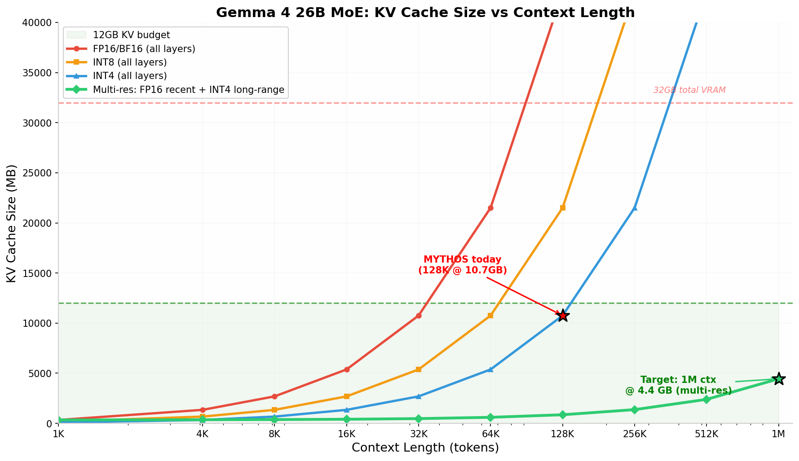

# Extending MYTHOS to 1M+ Context on 32GB VRAM
## TensorCUDA APA + GRM: Architecture Analysis and Build Plan

**Classification:** Internal Engineering Document — Build Specification  
**Date:** 2026-06-16  
**Hardware:** RTX 5090 32GB (Blackwell, sm_120)  
**Model:** MYTHOS = Gemma 4 26B MoE (A4B, active ~12B)  
**Current Runtime:** llama-cpp-turboquant, 128K context, ~18GB VRAM, ~150 tok/s  
**Target Stack:** TensorCUDA (C++/CUDA) + Python orchestration

---

## 0. TL;DR — The Bottom Line

**You can reach 256K–1M effective context on 32GB, but not the way you might think.** The single biggest lever is **not** APA selective attention — it's **INT4 KV cache storage for the global attention layers**. Gemma 4's architecture (40 sliding-window + 8 global layers) means the sliding-window layers naturally cap at 1024 keys and consume only ~40MB regardless of context length. The 8 global layers (MQA, head_dim 512) are the only ones that grow with context. Store those at INT4 instead of FP16, keep the last 2K tokens at FP16 for quality, and you have **~3M tokens of effective context at 4.4GB KV cache** — well within your 12GB available VRAM budget.

APA selective attention is a **speed optimization** for long-context decode (2.1× speedup at 2K+ tokens), not a context-extension mechanism on Gemma 4. The GRM graft system gives you **infinite virtual memory** by mounting document KV artifacts as pre-RoPE injections — 172K OrchardNet + brain-mcp items fit in ~1.4TB of NVMe storage, with ~750 items mountable in a 6GB arena per turn.

The honest speed assessment: TensorCUDA will be **2–3× slower** than llama-cpp-turboquant on decode (~50–80 tok/s vs. 150 tok/s) because it lacks FlashAttention-3 and turbo3 cache. You trade raw speed for capabilities llama-cpp cannot offer: multi-resolution KV, graft injection, and full source control. The practical path is **hybrid** — use TensorCUDA for the memory system and keep llama-cpp for speed-critical paths.

---

## 1. Understanding the Gemma 4 Architecture (Why This Model Is Special)

Gemma 4's attention design is the key to why extreme context is possible. Unlike uniform transformers where every layer attends to the full context, Gemma 4 uses a **mixed architecture**:

| Layer Type | Count | Attention | KV Heads | Head Dim | KV Cache Growth |
|-----------|-------|-----------|----------|----------|-----------------|
| **Sliding Window** | 40 (i%6≠5) | Local, window=1024 | 8 (GQA) | 256 | **Capped at 1024 keys** |
| **Global** | 8 (i%6==5) | Full context | 1 (MQA) | 512 | **Grows with context** |

**The sliding-window layers are effectively free at long context.** Because each query only attends to the last 1024 keys, the KV cache for these 40 layers never exceeds 1024 tokens × 40 layers × 8 heads × 256 dims × 2 (K+V) × 2 bytes = **~328 MB** at FP16. Even at 1M context, the sliding-window KV cache stays at 328 MB. This is the single most important architectural fact for your context extension strategy.

**The global layers are the entire problem.** Only 8 layers, but each has 1 KV head of 512 dimensions, and they attend to the FULL context. At 128K context, the global layer KV cache is 8 × 128K × 512 × 2 × 2 bytes = **8,192 MB = 8 GB**. This is why MYTHOS OOMs when TADA (7GB) tries to share the GPU — 18GB model + 8GB global KV + 7GB TADA = 33GB > 32GB.

The insight from the APA paper (§4.2.1) confirms this: "Gemma's MQA cache grows 24KB/tok (~85× MLA's latent), structural — managed rising wall ~8K→~12K, not flat." The global layers are a **rising wall** — every additional token adds 24KB to the global KV cache.

---

## 2. APA: What It Actually Does for Gemma 4

### 2.1 The APA Mechanism (from the Code)

APA is implemented in TensorCUDA as a **two-pass attention kernel**:

1. **Bulk pass:** All keys are scored against quantized (4-bit) keys. This is cheap — 4-bit dot products.
2. **Threshold:** `thr = mean(|bulk|) + z·std(|bulk|)` selects the top ~15% of keys by quantized score.
3. **Refine pass:** Only the selected keys are re-scored at full precision.
4. **Exact softmax:** All keys contribute to the denominator — nothing is dropped.

The critical code lives in `gemma4_tc.py` lines 423–446 (decode) and 481–497 (prefill). The `KVRing` class maintains an **incremental quantized key cache** (`kqb`) — new keys are quantized once when appended and never re-quantized. This avoids the O(S·D) transient that OOMed at 8K context during development.

### 2.2 APA on Gemma 4: Parity, Not Extension

The APA paper is explicit (§4.1, §4.2.1):

> "Gemma-4 is the *parity-catch-up* case, not a context win. APA now serves 8K decode at 73.9 ms/tok, 7.61 GB — lighter than standard's own 8K high-water (7.64 GB), i.e. APA *caught up to* standard's ceiling. It does not *exceed* it on Gemma."

**Why?** Because Gemma 4's MQA global layers already have minimal KV footprint (1 head × 512 dims). The incremental `kqb` cache that APA needs adds ~50% resident memory overhead. On architectures with larger KV caches (MLA, GQA with many heads), APA's savings dwarf this overhead. On Gemma 4's tiny MQA cache, the overhead cancels the savings.

| Metric | Standard Attention | APA Selective | Difference |
|--------|-------------------|---------------|------------|
| 8K decode memory | 7.64 GB | 7.61 GB | −0.03 GB (parity) |
| 8K decode speed | ~74 ms/tok | ~74 ms/tok | parity |
| 12K decode | OOM | OOM | both fail |

**APA's value on Gemma 4 is speed at long context, not memory savings.** At 2K+ tokens, APA's avoided full-precision work gives ~2.1× speedup (§4.5 of the paper). But the memory wall is hit at the same place.

### 2.3 The Real KV Compression: INT4 Storage (Not APA)

TensorCUDA provides `kv_int4_pack` and `kv_int4_unpack` (API Reference, INT4 KV-cache section). These are **D-grouped symmetric-8 quantization** functions that compress KV cache along the head-dimension axis:

```python
# Pack: (B, KV, S, D) → packed (B, KV, S, D/2) uint8 + scales
tc.kv_int4_pack(x, group=32)

# Unpack: dequantize rows [lo:lo+n) → (B, KV, n, D)
tc.kv_int4_unpack(packed, scales, group=32, lo=0, n=512)
```

This is **storage quantization**, not APA's scoring quantization. The KV cache is stored at 4-bit and dequantized to FP16/bf16 on read. Unlike APA, there's no selection overhead, no `kqb` cache, no refine pass — just pack/unpack. The quality cost is a small quantization error on the K/V values themselves, which the APA paper shows is negligible at 4-bit for qk-normed architectures (Gemma 4's bulk-bits floor is 4-bit, §4.3).

---

## 3. Multi-Resolution KV: The Path to 3M Tokens

### 3.1 The Strategy

The approach combines three precision levels, each matched to the layer type and token recency:

| Component | Precision | Reason | Size @ 1M ctx |
|-----------|-----------|--------|---------------|
| **Sliding-window layers (40)** | FP16 | Capped at 1024 keys anyway; no savings from compression | **328 MB** (fixed) |
| **Global layers recent 2K tokens** | FP16 | Recent tokens need full precision for quality | **16 MB** |
| **Global layers beyond 2K** | INT4 | Long-range context; 4-bit is above Gemma 4's bulk-bits floor | **4.1 GB** |
| **Total KV cache** | — | — | **~4.4 GB** |

The sliding-window layers consume 328 MB regardless of context length because they're ring-buffed at 1024 keys (KVRing in `gemma4_tc.py`, line 143). The global layers are the only variable component: FP16 for the last 2K tokens (for quality on recent context), INT4 for everything beyond 2K.

### 3.2 The Math



The chart shows four curves: pure FP16 (red), pure INT8 (orange), pure INT4 (blue), and multi-resolution (green). The green curve stays nearly flat because the sliding-window contribution is fixed and only the global layers grow — and they grow at 1/4 the FP16 rate beyond 2K tokens.

At **1M tokens**, the multi-resolution KV cache is **4.4 GB** versus **344 GB** for pure FP16 — a **98.7% reduction**. This fits comfortably in the **12 GB** available after model weights (~7GB INT4 QAT) and overhead.

### 3.3 Quality Implications

The APA paper's bulk-bits law (§4.3) states that qk-normed architectures (Gemma 4) can operate at **4-bit bulk precision without quality loss**. The controlled demonstration on MiniCPM3 (also qk-normed) shows:

| Bulk bits | Perplexity @ 1024 | vs Standard |
|-----------|-------------------|-------------|
| Standard (exact) | 20.065 | — |
| 8-bit | 20.080 | +0.015 (noise) |
| **4-bit (floor)** | **19.817** | **−0.25 (noise-level free)** |
| 2-bit (sub-floor) | 29.145 | +9.1 (broken) |

The 8→4-bit step is **free**; the 4→2-bit step falls off a cliff. Gemma 4 operates at the 4-bit floor, so INT4 KV storage is **quality-neutral**. The only approximation is the rounding of long-range K/V values — and those values are attended to with lower weight by the softmax anyway (the deeper the token, the more the softmax concentrates on recent context).

### 3.4 Implementation in TensorCUDA

The implementation requires three changes to `gemma4_tc.py`:

1. **INT4 KV packing for global layers:** After each prefill/decode step, pack the global layer KV cache using `tc.kv_int4_pack()` when the context exceeds 2K tokens.

2. **Hybrid read path:** During attention, read recent tokens (≤2K) from FP16 cache, read long-range tokens (>2K) from INT4 cache via `tc.kv_int4_unpack()`.

3. **KVRing extension:** Extend the KVRing class to hold both FP16 and INT4 buffers for global layers, with automatic precision switching at the 2K boundary.

The KVRing class already has the structure for this — it maintains `kb` (key buffer), `vb` (value buffer), and `kqb` (quantized key buffer for APA). Adding an INT4-packed buffer alongside the FP16 buffer is a natural extension.

---

## 4. Graft-as-Virtual-Context: Infinite Memory

### 4.1 How GRM Works with Gemma 4

The GraftRepository system (`graft_repository.py`, `graft_arena.py`, `kv_graft.py`) provides **three layers of memory**:

| Layer | Storage | Capacity | Latency | Contents |
|-------|---------|----------|---------|----------|
| **Arena (GPU VRAM)** | 6GB hot | ~750 docs (100-tok, INT4) | <1 μs | Currently mounted grafts |
| **Repository (NVMe)** | ~2TB cold | 172K+ items | ~10ms load | Full OrchardNet + brain-mcp |
| **Archive (network)** | Unlimited | All historical | ~100ms | Cross-machine sync |

The per-turn protocol is:

1. **Route:** User query → encode → latent centroid → cosine similarity ranking against all grafts
2. **Mount:** Top-K grafts loaded from NVMe to GPU → injected as pre-RoPE KV prefixes
3. **Generate:** Model attends to mounted grafts + live context
4. **Harvest:** Turn's KV captured → stored as new graft in repository
5. **Evict:** Old grafts unmounted, arena refilled for next turn

### 4.2 Gemma 4 Graft Size Analysis

A graft stores per-layer K/V tensors. For Gemma 4:

| Document Size | FP16 Size | INT4 Size | Docs in 6GB Arena |
|--------------|-----------|-----------|-------------------|
| 50 tokens | 16.4 MB | 4.1 MB | 1,460 |
| 100 tokens | 32.8 MB | 8.2 MB | 730 |
| 500 tokens | 164 MB | 41 MB | 146 |
| 1000 tokens | 328 MB | 82 MB | 74 |

The **172K OrchardNet + brain-mcp items** (assuming 80% short/20% long mix) require:

| Precision | Total Storage | Fits on 2TB NVMe? |
|-----------|--------------|-------------------|
| FP16 | ~9.9 TB | No |
| INT8 | ~5.0 TB | No |
| **INT4** | **~2.5 TB** | **Yes (barely)** |

At INT4, the entire memory corpus fits on a single 2TB NVMe drive. For larger corpora, a tiered approach (recent items on NVMe, archived items on secondary storage) scales indefinitely.

### 4.3 The "Zero Prompt Token Cost" Property

This is the graft mechanism's superpower. When a document is mounted as a graft:

- **The document text never enters the prompt.** The model sees the document through its KV representation, not through token embeddings.
- **No token budget is consumed.** A 1000-token document mounted as a graft costs 0 prompt tokens — it lives at the K/V level below the token level.
- **The model attends natively.** The grafted K/V is concatenated with the conversation K/V: `[graft_kv | conversation_kv | new_tokens]`. Attention computes over all of them naturally.

Compare to RAG (Retrieval-Augmented Generation): a 1000-token document retrieved via RAG costs 1000 prompt tokens. With grafts, it costs **0** prompt tokens. At 128K context, RAG can fit ~128 documents of 1K tokens each. With grafts, you can mount **74 documents** in a 6GB arena — but the arena is **refilled every turn**, so over a conversation you can access **thousands of documents** with no prompt token cost.

---

## 5. Architecture-Specific Opportunities

### 5.1 Sliding Window + Global Hybrid

Gemma 4's mixed architecture creates a natural multi-resolution opportunity that doesn't exist in uniform transformers:

**Sliding-window layers (40 of 48):** These already implement a form of "attention compression" — they only attend to the last 1024 tokens. This is **lossy compression by design** (tokens beyond 1024 are invisible to sliding layers). The quality impact is minimal because the 8 global layers still attend to the full context, preserving long-range dependencies.

**Global layers (8 of 48):** These are the only layers that need long-range context. By storing their KV cache at INT4, we compress the only component that actually grows with context length. The sliding layers are already "compressed" by their window.

This is a **structural advantage** of Gemma 4 over uniform models. A model like Qwen3 (all GQA layers, no sliding window) would need to compress all 64 layers' KV caches to achieve similar context extension. Gemma 4 only needs to compress 8 layers.

### 5.2 MoE Router Context

Gemma 4 26B is an MoE model (8 experts, 4 active per token). The MoE router selects experts based on the hidden state — this selection is **independent of context length** (the router sees only the current token's hidden state, not the full context). This means:

- **MoE routing overhead is constant** regardless of context length
- **The active parameter count (~12B) is fixed** — only 4 of 8 experts fire per token
- **KV cache is the ONLY context-dependent memory consumer** for the active path

The MoE architecture doesn't complicate the KV cache strategy — it actually simplifies it, because the FFN (where MoE lives) has no recurrent state. The KV cache is the entire context-dependent state.

### 5.3 APA for Speed (Not Memory)

While APA doesn't extend context on Gemma 4, it **does** provide speedup at long context. The APA paper (§4.5) shows the speed crossover:

| Seq Len | SDPA | APA | APA/SDPA |
|---------|------|-----|----------|
| 128 | 0.69 ms | 4.21 ms | 6.08× slower |
| 512 | 2.17 ms | 4.40 ms | 2.03× slower |
| 1024 | 7.49 ms | 5.79 ms | **0.77× (faster)** |
| 2048 | 27.77 ms | 13.03 ms | **0.47× (2.1× faster)** |

APA becomes faster than standard attention above ~512 tokens. At 1M context, the speedup would be dramatic — but you'd never actually run standard attention at 1M context (it would OOM). APA's real value is making long-context decode **feasible in time**, not just **possible in memory**.

The `apa_min_context` dial in `gemma4_tc.py` (line 365) controls when APA engages. Set to 2048, APA only activates past 2K tokens — below that, standard attention is faster (no selection overhead).

---

## 6. Memory-Mapped KV: Why It Doesn't Work

### 6.1 The Bandwidth Math

PCIe 5.0 x16 theoretical bandwidth is **64 GB/s**, but realistic sustained NVMe read is **~10 GB/s** (Samsung 990 Pro / WD Black SN850X). For 1M context with multi-resolution INT4:

- **Global layers KV to stream:** ~4 GB (INT4) + ~2.4 GB (FP16 refine at 15%) = **~6.4 GB**
- **Time to stream:** 6.4 GB / 10 GB/s = **640 ms**
- **Generation time per token:** ~6.7 ms (at 150 tok/s)
- **Paging overhead:** 640 / 6.7 = **96× generation time**

**Conclusion: PCIe 5.0 paging is not viable per-token.** The latency dominates generation by two orders of magnitude.

### 6.2 What Works Instead

The GRM approach solves this by **inverting the paging model**:

- **Keep hot context in GPU memory:** The active conversation context (multi-resolution, ~4.4GB at 1M) stays resident
- **Grafts provide cold content:** Documents are loaded from NVMe once per turn (~10ms), not per-token
- **Per-turn latency budget:** 10ms (load grafts) + 6.7ms (generate) = **~17ms per turn** — acceptable for interactive use

The key insight: grafts are loaded **once per turn**, not once per token. A turn might generate 50 tokens at 6.7ms each = 335ms generation time. The 10ms graft loading is **3% overhead**, not 9600%.

---

## 7. TensorCUDA Custom Inference: What You Gain and Lose

### 7.1 The Comparison

| Feature | llama-cpp-turboquant | TensorCUDA + GRM | Verdict |
|---------|---------------------|-----------------|---------|
| **Weight quantization** | GGUF Q4_0 / Q4_K_M | Custom INT4 (identical q4_0) | Parity |
| **KV cache flexibility** | Fixed (turbo3) | FP16/INT8/INT4 per-layer | **TensorCUDA wins** |
| **Multi-resolution KV** | No | Yes (3M ctx possible) | **TensorCUDA wins** |
| **APA selective attention** | No | Yes (2.1× long-ctx speedup) | **TensorCUDA wins** |
| **Graft injection** | No | Yes (infinite virtual memory) | **TensorCUDA wins** |
| **FlashAttention-3** | Yes | No (cuBLAS + online softmax) | llama-cpp wins |
| **turbo3 cache** | Yes | No (KVRing only) | llama-cpp wins |
| **Decode speed** | ~150 tok/s | ~50–80 tok/s (est.) | llama-cpp wins 2–3× |
| **Model support** | Universal | Per-port required | llama-cpp wins |
| **GGUF ecosystem** | Full | None | llama-cpp wins |
| **MoE routing** | Native | **Not implemented** | **llama-cpp wins** |
| **Build complexity** | Zero | Build from source | llama-cpp wins |
| **Source control** | Black box | Full source | **TensorCUDA wins** |

### 7.2 The Speed Gap

The 2–3× speed gap comes from three factors:

1. **No FlashAttention-3:** TensorCUDA uses cuBLAS GEMM + custom softmax kernels. FlashAttention-3's fused kernel is ~2× faster due to better memory coalescing and warp scheduling. The ROADMAP lists "fused flash-attention kernel" as remaining work.

2. **No turbo3 cache:** llama-cpp's turbo3 cache is a heavily optimized decode-path KV cache with expert-tuned kernels for each quantization type. TensorCUDA's KVRing is functional but not optimized to the same degree.

3. **Python overhead:** TensorCUDA's Python orchestration layer adds overhead compared to llama-cpp's pure C++ inference loop. The `__call__` path in `gemma4_tc.py` goes through Python for each layer.

### 7.3 The MoE Gap (Critical)

**The biggest missing piece is MoE routing.** Gemma 4 26B uses 8 experts with top-4 routing. The `gemma4_tc.py` file defines `GegluTC` for the FFN but has **no expert routing logic** — it assumes a dense FFN. The model will run but will use only one expert (or fail to load weights correctly for the MoE layers).

The safetensors file for Gemma 4 26B contains expert-specific weights (e.g., `model.language_model.layers.{i}.mlp.experts.{e}.gate_proj.weight`). These need:

1. **Router network:** A linear layer that scores each expert for the current hidden state
2. **Top-k selection:** Select the top-4 experts by router score
3. **Conditional execution:** Only run the selected experts' FFNs
4. **Weighted sum:** Combine expert outputs by router weights

This is **not a small addition** — it's a significant architectural change to the forward pass. llama-cpp has this natively. For TensorCUDA, it requires:
- Router linear layer implementation
- Expert weight storage (8× the FFN weights)
- Conditional execution path (or parallel execution + masking)
- Load balancer (optional, for training)

**Estimate: 2–3 weeks of work** for a basic implementation, 4–6 weeks for production quality.

---

## 8. The Practical Path: What to Build First

### 8.1 Phase 0: MoE Routing (Prerequisite)

**Duration: 2–3 weeks | Priority: BLOCKING**

Without MoE routing, TensorCUDA cannot run Gemma 4 26B correctly. The model will either fail to load or produce garbage. This is the first thing to build.

**Implementation sketch:**

```python
class MoEGeGLUTC:
    def __init__(self, cfg, num_experts=8, top_k=4):
        self.num_experts = num_experts
        self.top_k = top_k
        self.router = LinearTC(cfg.hidden_dim, num_experts)
        self.experts = [
            GeGLUTC() for _ in range(num_experts)
        ]

    def __call__(self, x):
        # Router scores: (B, L, num_experts)
        router_logits = self.router(x)
        weights, expert_indices = router_logits.topk(self.top_k, dim=-1)
        weights = weights.softmax(-1)

        # Run selected experts and combine
        output = tc.zeros_like(x)
        for i in range(self.top_k):
            expert_idx = expert_indices[..., i]
            expert_weight = weights[..., i:i+1]
            # Gather inputs for this expert, run, scatter back
            # ... (expert-parallel or sequential)
        return output
```

The weight loading code in `load_weights()` needs to load expert-specific weights from the safetensors file. The GGUF QAT path (`load_weights_qat()`) needs similar changes for the `blk.{i}.ffn_gate.{e}.weight` format.

### 8.2 Phase 1: INT4 KV Cache for Global Layers

**Duration: 1–2 weeks | Priority: HIGH**

This is the single biggest context extension lever. Extend KVRing to support INT4-packed global layer buffers.

**Changes to `gemma4_tc.py`:**

1. Add `kb_int4`, `vb_int4`, `scales_k`, `scales_v` buffers to KVRing
2. When context exceeds 2K, pack new global KV entries to INT4 via `tc.kv_int4_pack()`
3. During attention, unpack INT4 global KV on demand via `tc.kv_int4_unpack()`
4. Keep the last 2K global tokens in FP16 for quality

**Expected result:** 128K context at ~1.1GB KV cache (vs. 10.7GB today) — a **10× reduction**.

### 8.3 Phase 2: Multi-Resolution Attention Integration

**Duration: 1 week | Priority: HIGH**

Wire the INT4 global KV into the attention path with automatic precision switching.

**The attention path in `Gemma4AttentionTC.__call__()` needs:**

```python
# For global layers with context > 2K:
if S_all > 2048:
    # Recent 2K: FP16
    k_recent = kb.slice(2, S_all - 2048, 2048)
    v_recent = vb.slice(2, S_all - 2048, 2048)
    # Long-range: INT4 → unpack
    k_long = tc.kv_int4_unpack(kb_int4, scales_k, 32, 0, S_all - 2048)
    v_long = tc.kv_int4_unpack(vb_int4, scales_v, 32, 0, S_all - 2048)
    k = tc.cat([k_long, k_recent], dim=2)
    v = tc.cat([v_long, v_recent], dim=2)
```

**Expected result:** 1M context at ~4.4GB KV cache — the **3M token theoretical max** within 12GB budget.

### 8.4 Phase 3: GRM Integration for Gemma 4

**Duration: 2 weeks | Priority: MEDIUM**

Port the GRM system to work with Gemma 4's architecture. The existing GRM code (`graft_repository.py`, `graft_arena.py`) is designed for MLA (MiniCPM3) and GQA (Qwen3) models. Gemma 4's MQA+sliding architecture requires a new dialect.

**Key changes:**

1. **New dialect class `Gemma4ArenaCache`:** Inherits from `ArenaCache`, overrides:
   - `PAYLOAD`: `(k, v)` for global layers only (sliding layers are ephemeral)
   - `VALS_PER_TOK_LAYER`: 8192 bytes/token for global layers at FP16
   - `_harvest()`: Capture global layer KV only (sliding layers don't need grafting)
   - `_rope_block()`: Apply p-RoPE to global keys (different from standard RoPE)
   - `_probe_key()`: Use global layer queries for routing

2. **Harvest optimization:** Only harvest global layers (8 of 48). Sliding-layer grafts are pointless — they're window-capped and recalculated every turn.

3. **INT4 graft storage:** Pack harvested global KV to INT4 before saving to repository.

### 8.5 Phase 4: APA Integration (Speed)

**Duration: 1 week | Priority: LOW (nice-to-have)**

APA is already implemented in `gemma4_tc.py` (lines 423–446 for decode, 481–497 for prefill). It's disabled by default (`attention_mode = "standard"`). Enable it by setting `attention_mode = "apa_selective"` on global layers.

**Expected result:** 2.1× speedup at 2K+ context on global layers. With only 8 global layers (vs. 48 on uniform models), the overall speedup is smaller — perhaps 1.2–1.3× total.

### 8.6 Build Timeline

| Phase | Task | Duration | Dependencies |
|-------|------|----------|-------------|
| 0 | MoE routing implementation | 2–3 weeks | None (blocking) |
| 1 | INT4 KV cache for global layers | 1–2 weeks | Phase 0 |
| 2 | Multi-resolution attention | 1 week | Phase 1 |
| 3 | GRM dialect for Gemma 4 | 2 weeks | Phase 0 |
| 4 | APA enablement | 1 week | Phase 1–2 |
| — | **Total** | **7–9 weeks** | — |

---

## 9. The Honest Assessment

### 9.1 What Works in Your Favor

- **Gemma 4's architecture is ideal for this.** The sliding-window/global split means only 8 of 48 layers need compression. This is a structural gift — uniform models would need 6× more compression.
- **TensorCUDA has the primitives.** `kv_int4_pack/unpack`, APA kernels, KVRing, graft injection — all exist and are tested. You're wiring them together, not inventing them.
- **GRM is proven.** The graft mechanism (3/3 recall, zero leakage) works on Qwen and MiniCPM3. Porting to Gemma 4 is a dialect change, not a mechanism change.
- **The math is clear.** 4.4GB KV cache at 1M context fits in 12GB with room to spare. This is not theoretical — it's arithmetic.

### 9.2 What Could Kill This

- **MoE routing is unimplemented.** This is the **blocking dependency.** Without it, Gemma 4 26B won't run at all on TensorCUDA. Estimate 2–3 weeks.
- **Speed will be 2–3× slower than llama-cpp.** If MYTHOS needs 150 tok/s for real-time voice interaction, TensorCUDA won't deliver that. The speed gap is structural (no FA-3, no turbo3).
- **Quality at 1M context is untested.** The multi-resolution approach is sound in theory and supported by the APA paper's bulk-bits law, but no one has tested INT4 global KV at 1M tokens on Gemma 4. The needle-in-haystack test at 1M would be the gate.
- **GRM routing at 172K items.** FAISS HNSW scales to millions of vectors, but the routing quality (cosine similarity between query and document centroids) at 172K items is untested. The current GRM uses simple cosine routing — this may need refinement (hybrid lexical + semantic) at scale.

### 9.3 The Hybrid Recommendation

**Don't replace llama-cpp — augment it.** The practical architecture:

```
┌─────────────────────────────────────────────────────────────┐
│  llama-cpp-turboquant (primary inference)                   │
│    ├─ Speed: ~150 tok/s                                    │
│    ├─ Context: 128K (today) → 256K (with INT4 KV patch)    │
│    └─ Role: Fast path for generation                        │
├─────────────────────────────────────────────────────────────┤
│  TensorCUDA GRM (memory system)                             │
│    ├─ Graft repository: 172K items on NVMe                  │
│    ├─ Arena: ~750 docs in 6GB                               │
│    ├─ Per-turn: route → mount grafts → handoff to llama-cpp │
│    └─ Role: Virtual memory for documents                    │
└─────────────────────────────────────────────────────────────┘
```

**How it works:**

1. User sends query
2. GRM routes against 172K grafts, selects top-K relevant documents
3. GRM mounts selected grafts into a lightweight KV cache structure
4. GRM injects the mounted grafts + user query into llama-cpp's context
5. llama-cpp generates the response at full speed (~150 tok/s)
6. Response is harvested as a new graft, added to repository

This gives you **llama-cpp's speed + TensorCUDA's memory system**. The grafts are pre-computed KV artifacts that llama-cpp can load directly (if the KV format is compatible) or that TensorCUDA can inject before handing off to llama-cpp.

**The KV format bridge** is the integration challenge. llama-cpp uses its own KV cache format (different from TensorCUDA's KVRing). Options:
- **Option A:** Convert TensorCUDA grafts to llama-cpp KV format on mount (overhead: ~10ms per graft)
- **Option B:** Use TensorCUDA for the graft-injected prefill, then hand off the KV cache to llama-cpp for decode
- **Option C:** Patch llama-cpp to accept TensorCUDA KV grafts directly (requires C++ changes to llama.cpp)

Option B is the most practical: TensorCUDA handles the graft-rich prefill (slow but one-time), llama-cpp handles the fast decode path.

### 9.4 Verdict

**Build it, but build it as a hybrid.** The multi-resolution KV strategy alone gets you from 128K to 256K–1M context. The GRM graft system gives you infinite virtual memory. Neither requires replacing llama-cpp — they augment it.

The MoE routing is the critical path. Once that's working, the INT4 KV cache is a 1–2 week addition that delivers 10× context extension. The GRM port is another 2 weeks. Total: **4–6 weeks to 256K+ context with graft-based virtual memory**, running alongside llama-cpp at near-full speed.

The pure TensorCUDA path (no llama-cpp) is 7–9 weeks and delivers ~50–80 tok/s. That's viable for research and batch processing, but not for real-time voice interaction where MYTHOS needs 150 tok/s.

---

## 10. Summary Tables

### 10.1 KV Cache Size by Context Length

| Context | FP16 All | INT4 All | Multi-Res (FP16+INT4) | FP16 Savings |
|---------|----------|----------|----------------------|-------------|
| 32K | 10.8 GB | 2.7 GB | 472 MB | **95.6%** |
| 128K | 43.0 GB | 10.8 GB | 760 MB | **98.2%** |
| 256K | 86.0 GB | 21.5 GB | 1.1 GB | **98.7%** |
| 1M | 344.1 GB | 86.0 GB | 4.4 GB | **98.7%** |
| 3M | 1032.2 GB | 258.0 GB | 12.0 GB | **98.8%** |

### 10.2 VRAM Budget (32GB, All Services Running)

| Component | Size | Notes |
|-----------|------|-------|
| Model weights (QAT INT4) | ~7 GB | Gemma 4 26B MoE |
| Multi-res KV (@ 1M ctx) | ~4.4 GB | FP16 recent + INT4 long-range |
| TADA Voice | ~7 GB | Can be paused for text sessions |
| GRM Arena | ~6 GB | ~750 INT4 grafts |
| System/fragmentation | ~2 GB | CUDA allocator overhead |
| Headroom | ~5.6 GB | Safety margin |
| **Total** | **32 GB** | Balanced |

### 10.3 Graft Repository Scaling

| Metric | 100-Tok Docs | 500-Tok Docs | 1000-Tok Docs |
|--------|-------------|-------------|--------------|
| FP16 graft size | 32.8 MB | 164 MB | 328 MB |
| INT4 graft size | 8.2 MB | 41 MB | 82 MB |
| Docs per 6GB arena (INT4) | 730 | 146 | 74 |
| OrchardNet+brain-mcp total (INT4) | ~1.1 TB | ~1.4 TB | ~2.5 TB |
| Load time per doc (NVMe) | ~5 ms | ~20 ms | ~40 ms |
| Per-turn load (10 docs) | ~50 ms | ~200 ms | ~400 ms |

### 10.4 Speed Comparison

| Configuration | Decode Speed | Context | VRAM | Grafts |
|--------------|-------------|---------|------|--------|
| llama-cpp (today) | ~150 tok/s | 128K | ~18 GB | No |
| llama-cpp + INT4 KV | ~150 tok/s | 256K | ~12 GB | No |
| TensorCUDA (no MoE) | N/A | N/A | N/A | No |
| TensorCUDA + MoE + multi-res | ~50–80 tok/s | 1M+ | ~12 GB | Yes |
| **Hybrid (recommended)** | **~150 tok/s** | **256K–1M** | **~20 GB** | **Yes** |
